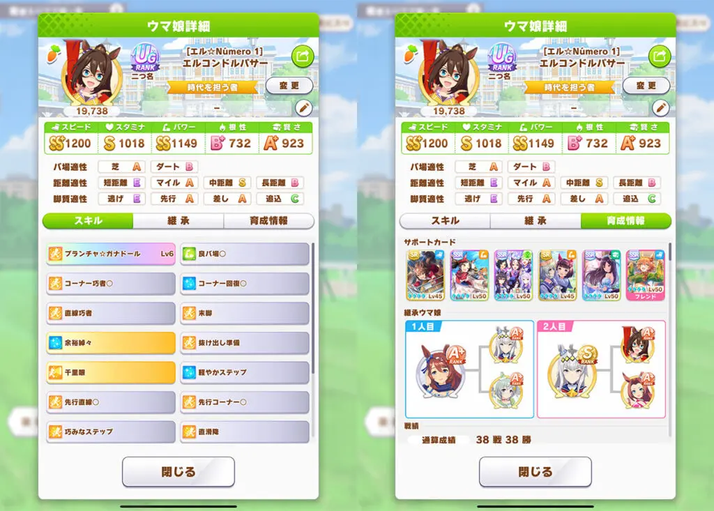
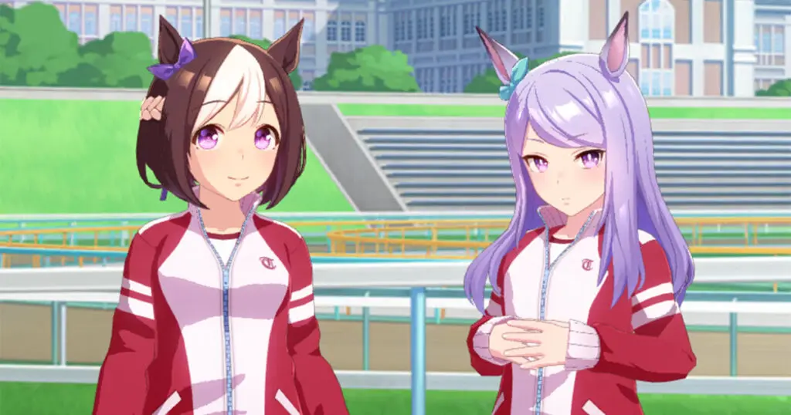
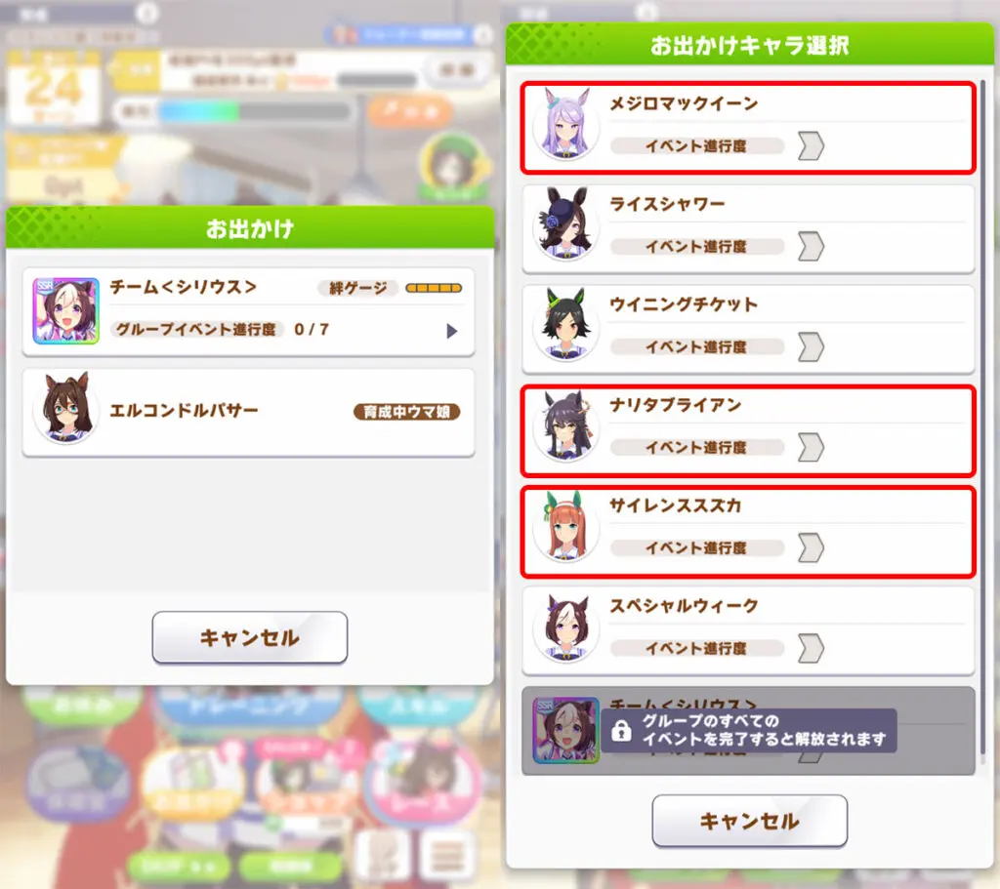
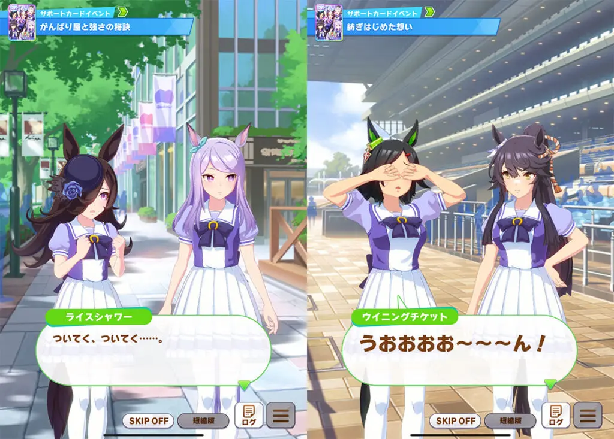
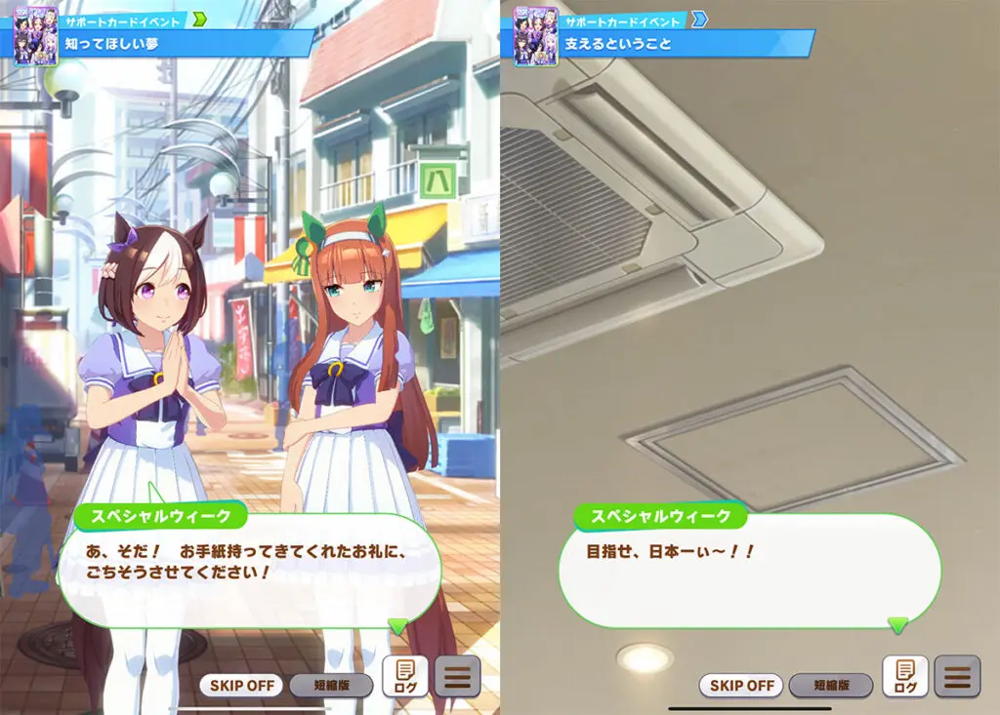
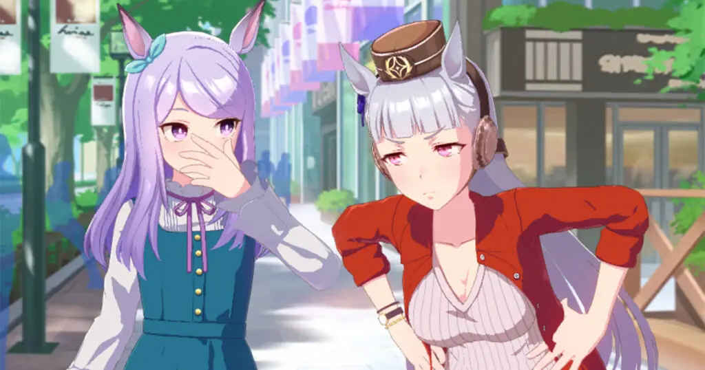
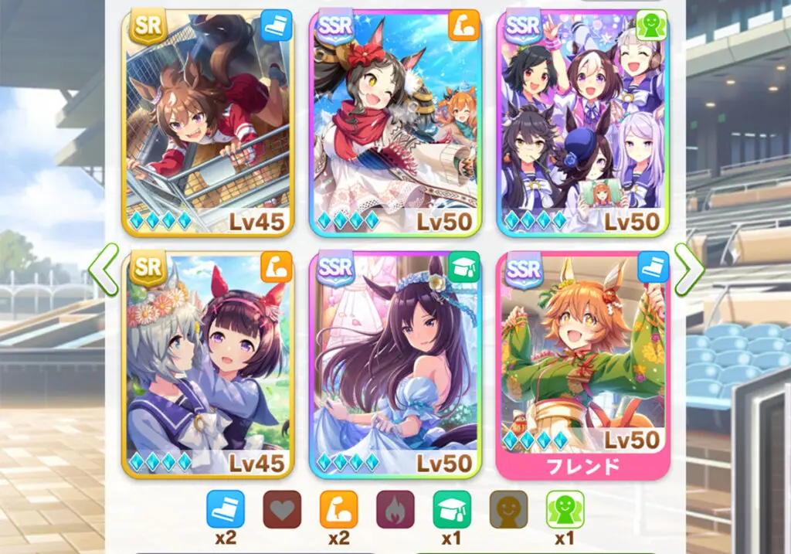
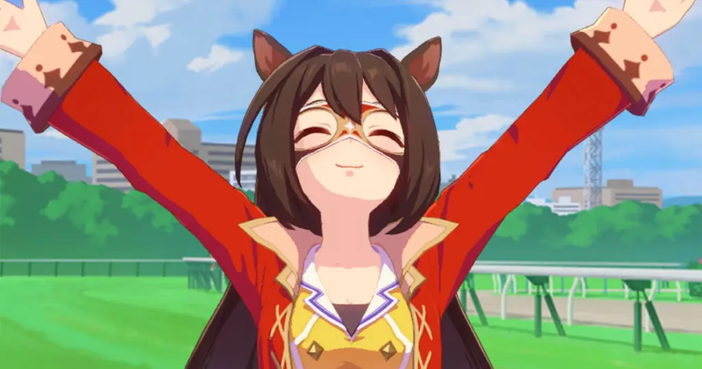

# Welfare SSR Team \<Sirius\> Usage Guide

*Translated from [umamusumelabo.com](https://umamusumelabo.com/beginner/team-sirius-guide) by Rene ([@renekuroi](https://twitter.com/renekuroi))*

---

Hello, this is Rene ([@renekuroi](https://twitter.com/renekuroi)).

Today's topic: **"A guide to getting the most out of the first-ever group support card, the welfare SSR Team \<Sirius\>."** This support recently arrived as a story reward welfare SSR, and while it has exceptionally high performance for a welfare card, it's a bit quirky to use. I imagine some trainers out there are struggling to get the most out of it.

So I've decided to write an article explaining **how to run SSR Team \<Sirius\> for strong training results**. Since anyone can max limit break this SSR just by collecting Club Points, I hope this guide will be helpful.

## UG-Rank Training Sample with \<Sirius\> + Welfare SSR + SR Lineup

Before getting into the details, some of you might be wondering **"Is SSR Team \<Sirius\> actually any good?"** — so as proof, here's a sample uma that **achieved UG rank using SSR Team \<Sirius\> + welfare SSRs + SRs only (aside from the rental slot)**.

I threw this together in a rush after deciding to write this article — I failed Fukukitaru's first attempt, and Recreations didn't unlock until late December of Junior year, so it wasn't particularly early. You could definitely do better than this. As for the race rotation, I made minor adjustments on the fly, but it's basically the same as the "Mile + Medium + Long (Turf + Dirt)" rotation from the article below, so feel free to reference that.

> *Related: [Race Rotation Guide for Maximizing Title Bonuses](https://umamusumelabo.com/beginner/race-rotation-guide)*

## Unlock Recreations Early — It Only Takes One Training Session

SSR Team \<Sirius\> is useless until you unlock Recreations, but **unlocking Recreations only requires training together once**. In my experience, the Recreation unlock event seems to trigger less frequently than with Friend-type supports, so I recommend getting it done as early as possible.

## Recreation Techniques for Getting the Most Out of Team \<Sirius\>

### First: Use Up the Non-Recovery Recreations — Suzuka, Narita Brian, McQueen

The key to using this support card effectively is **mastering the Recreation technique**. The stat gains you earn from Recreations are the main source of this card's strength, so how well you handle them determines how good your trained uma will turn out.

So how should you approach Recreations? **First, use up Silence Suzuka, Narita Brian, and Mejiro McQueen's Recreations between early-game races.** In particular, **Silence Suzuka** costs 5 energy but gives **+18 Speed and +18 Power**, which also helps you win races — so do hers first.

During these Recreations, your energy won't recover, so you'll end up entering races at 0 energy with the risk of getting "Race Fatigue." But as long as you don't pick up the "Bad Condition" debuff (or can cure it with an item), you can get through them smoothly while boosting your stats.

For reference, with my sample El Condor Pasa, Recreations unlocked in late December of Junior year, and I used them like this: Classic January 1st half "Suzuka" → Classic January 2nd half "Narita Brian" → Classic February 1st half "Race" → Classic February 2nd half "McQueen". Of course, if Recreations unlock earlier, you can start using them during Junior year.

### Next: Use Up Rice Shower and Winning Ticket. Use Special Week Like a Rest Day

Next up are **Rice Shower** (energy +32 recovery) and **Winning Ticket** (energy +13 recovery & mood +1). Both are best used between races right before a 2-race or 3-race streak. However, since **Winning Ticket** only recovers 13 energy, I recommend using it when you have at least 8 energy remaining.

After those are done, use **Special Week** (energy +52 recovery) as a pseudo "rest day" somewhere convenient. Then, once all individual Recreations are consumed, the **Team \<Sirius\> group Recreation** becomes available — use it between Senior-class races. Following this order should let you get through everything smoothly while maximizing your stat gains.

## Buy Cupcakes for Mood Recovery. Ignore "Pure Passion: Team Sirius"

One weakness of SSR Team \<Sirius\> is **the lack of mood recovery events**. Outside of random events, **Winning Ticket's Recreation is the only mood recovery opportunity you get**, so make sure to **prioritize buying cupcakes from the shop**. Also, since you're using Recreations frequently, you'll have fewer turns to build bond levels before the first Summer Training Camp — ideally you'd supplement with BBQ items and the like. But that's down to shop RNG, so... just pray.

As for **"Pure Passion: Team Sirius"** — **this support card's Pure Passion performance is quite poor, so just pretend it doesn't exist**. If it happens to line up with a training you wanted to do anyway, consider it a lucky bonus.

## Build Your Support Lineup to Cover Race Bonus — Aim for 50%+

The image above shows the support lineup I used for this sample training. **SSR Team \<Sirius\> only provides 5% race bonus**, so ideally you want to supplement it from your other support cards. **Prioritize supports with high race bonus and aim for 50%+ total.** This particular lineup has 65%.

For the borrow slot, if you don't have one yourself, **a max limit break SSR Matikane Fukukitaru** is recommended. She has 10% race bonus, and her all-stats +30 bonus has incredible synergy with the Climax scenario. That said, if you're purely trying to maximize evaluation, running Wisdom → Stamina or similar is probably easier to optimize, so don't feel locked into this exact setup.

## Final Thoughts

That wraps up the **"Welfare SSR Team \<Sirius\> Usage Guide"**. How was it? Even if you've been struggling to use this card effectively, following the approach outlined here should let you get strong results.

This card has **exceptional performance among welfare SSRs**, so please give SSR Team \<Sirius\> a try in your future training runs — master its quirks and use it as a powerful companion for strong results. Until next time!

---

*Original article: [umamusumelabo.com/beginner/team-sirius-guide](https://umamusumelabo.com/beginner/team-sirius-guide)*
