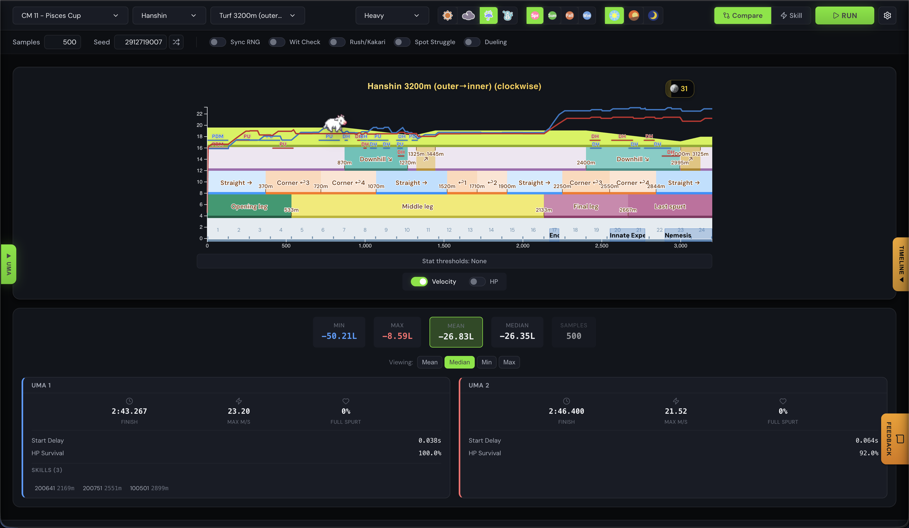

# Moomoolator

*A modern Uma Musume race simulator with bilingual JP/EN support*

[](https://umalator.app/umalator-global)
[](../uma-skill-tools/LICENSE)
[](https://www.typescriptlang.org/)
[](https://preactjs.com/)
[](https://umalator.app/umalator)

> A hybrid fork of [alpha123/umalator](https://github.com/alpha123/umalator) and [kachi-dev/umalator](https://github.com/kachi-dev/umalator) with a redesigned interface and quality-of-life improvements.



## Live Tools

| Tool | Description |
|------|-------------|
| **[/umalator-global](https://umalator.app/umalator-global)** | Global simulator (English) |
| **[/umalator](https://umalator.app/umalator)** | Bilingual JP simulator |
| **[/hp-calculator](https://umalator.app/hp-calculator)** | HP survival rate calculator |

---

## Why Moomoolator?

### True Bilingual Support
The only simulator with full JP/EN language mixing:
- UI in English, skill names in Japanese (or vice versa)
- Switch languages without losing your build
- Perfect for players who learned on JP but play Global

### Mobile-First Design
Fully responsive interface with dedicated mobile navigation—theorycraft from anywhere.

### Modern UX
- Guided onboarding tour for new users
- Uma Card export (shareable PNG with embedded build data)
- AI-powered OCR import from screenshots
- Native-feeling modal dialogs
- Dark/light themes

---

## Comparison

| | Moomoolator | VFalator | alpha123 |
|---|:-----------:|:--------:|:--------:|
| **Bilingual JP+EN** | **Yes** | - | - |
| **English UI** | Yes | Yes | Yes |
| **Japanese UI** | Yes | Yes | - |
| **Modern UI** | Yes | Yes | - |
| **Mobile** | Yes | - | - |
| **Uma Card PNG** | Yes | - | - |
| **OCR Import** | Yes | - | - |
| **Onboarding Tour** | Yes | - | - |

---

## Quick Start

### Using the Simulator

1. Visit one of the [live tools](#live-tools) above
2. Select a track and course from the header
3. Click **Uma** to configure your horse's stats, aptitudes, and skills
4. Click **RUN** to simulate races
5. View results in the track overlay and results panel

### Understanding Results

Results are measured in **horse lengths** (bashin):
- **1 horse length = 2.5 meters**
- **Positive values**: Uma 2 finishes ahead
- **Negative values**: Uma 1 finishes ahead

---

## Features

### Race Simulation
- **Compare Mode**: Pit two Uma builds head-to-head across hundreds of simulated races
- **Statistical Analysis**: View min/max/mean/median results
- **Track Visualization**: Interactive course with corners, slopes, and skill regions

### Build Management
- **Save/Load Builds**: Store multiple horse configurations locally
- **Uma Card Export**: Save builds as shareable PNG images with embedded data
- **OCR Import**: Extract stats from in-game screenshots using Google Gemini AI
- **JSON Import/Export**: For backup and sharing

### Champions Meeting Presets
Quick-load race conditions for upcoming CM and LoH events with correct track, weather, season, and ground settings.

---

## Development

### Prerequisites
- Node.js 20+

### Local Development

```bash
cd umalator-global

# Start dev server with hot reload
node build.mjs --serve

# Access at http://localhost:8000/umalator-global/
```

### Production Build

```bash
node build.mjs          # Minified production build
node build.mjs --debug  # Unminified with assertions
```

### Project Structure

```
umalator-global/
├── v2/                      # V2 UI source
│   ├── app-v2.tsx          # Main application
│   ├── components/         # Reusable UI components
│   └── *.css               # Styles
├── build.mjs               # esbuild configuration
├── skill_data.json         # English skill definitions
├── course_data.json        # Race course data
└── umas.json               # Character data
```

### Updating Game Data

After game updates, regenerate data files from the master database:

**Windows:**
```batch
update.bat [path-to-master.mdb]
```

**Linux/Mac:**
```bash
perl make_global_skill_data.pl /path/to/master.mdb > skill_data.json
perl make_global_skillnames.pl /path/to/master.mdb > skillnames.json
perl make_global_course_data.pl /path/to/master.mdb courseeventparams > course_data.json
```

Requires Perl with `DBI` and `DBD::SQLite` modules.

---

## Technology

- **Preact** - Lightweight UI framework
- **TypeScript** - Type-safe development
- **D3.js** - Data visualization
- **esbuild** - Fast bundling
- **Web Workers** - Parallel simulation

---

## Credits

Built on the work of:

- **alpha123/umalator** - Original Global simulator by alpha123 & pecan
- **kachi-dev/umalator (VFalator)** - VFcord version by kachi & Jecht
- **Skill Data** - [GameTora](https://gametora.com/umamusume)
- **Game** - Uma Musume: Pretty Derby © Cygames
- **Community** - [Moomoo Discord](https://discord.gg/moomoocows)

---

## License

GPL-3.0-or-later - See [LICENSE](../uma-skill-tools/LICENSE)
